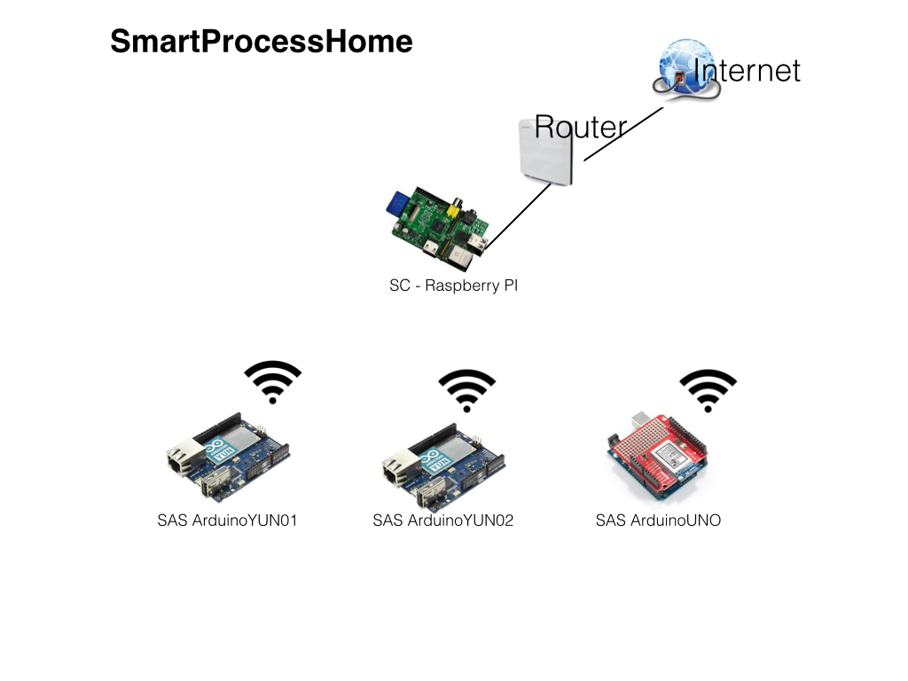

SmartProcessHome
================

 Proyecto raspberry PI + Arduino
 
 30/05/2014
 
 
 
 El proyecto tiene dos niveles:
 
 1. Un sistema de control (SC) compuesto de una placa Raspberry PI. En el SC existen varias aplicaciones para el control de la base de datos y los procesos. 
 
 2. Diferentes sistemas de actuadores / Sensores (SAS) que pueden ser Arduino UNO con Wifly Shield o Arduino YUN. Es necesario que los sistemas Actuadores tengan conexión a red para poder interactuar con el SC.

***
##Sistema de control (controlsystem)
* Raspberry Pi con BerriBoot
* Es el encargado de mantener la Base de Datos (DB) y de realizar los procesos de mantenimiento de DB y de procesamiento de SAS que no tengan capacidad de almacenamiento propia (Arduino Wifly).

#### Funcionalidad:

1. Recibir información de los distintos dispositivos y almacenarlos en la DB
2. Lanzar eventos a los actuadores de los diferentes sistemas a través de REST (web Services).

Se crea una carpeta en /home/pi/nooxs en donde se almacenan los siguientes script's:

**class_profiles.py**

Módulo de gestión de ficheros de configuración

**DBMantenimiento.py**

* Aplicación de Gestión de Base de Datos
* Python
* Fichero de configuracion nooxs.config
en /etc/config
* se puede conectar a DB MySQL o a SQLite
conexión en remoto o en local
* opciones:
	* Configuración. Definición de diferentes parámetros de configuración. He mantenido esta opciónpara nuevas versiones, pues para esta primera versión, los parámetros de configuración se recogen el fichero nooxs.config en /etc/config/ en cada SAS. Por lo tanto no aplica en esta versión.
	* Dispositivos. Mantenimiento de los diferentes SAS que componen la red. Hay que dar de alta todos las placas Arduino que componen la red. Se puede activar o desactivar un SAS. Activar un dispositivo significa que el mismo, sus Pines activos, van a generar información en la base de datos cada minuto (estado). Si desaxtivamos un SAS, el mismo sigue dado de alta pero no genera registro de actividad ni se puede actuar sobre sus pines.
	* Sensores/Actuadores. Mantenimineto de los diferentes pines de un SAS en particular. Se activarán los pines que tengan conectado un sensor o actuador. Se pueden crear los pines asignánoles un tipo (Digital o Analógico) y un modo (Input/Output). Al asignar u modo a un PIN el sistema lo configura automáticamente en ese modo en la placa arduino a través de un WebService (curl).
	* Registro Instantaneo. En cada SAS se genera un registro cada minuto del estado de los pines activos de ese SAS en particular.
	* Registro Diario. Cada día, a través de la aplicación procesaregistro.py (activada en el cron del SC) se sumarizan los datos del dia de cada pin y se incluyen en un registro diario de cada pin. Esta es la información que s epuede consultar en esta opción.
	
	  	

**procesa.py**

Esta es la aplicación incluida en cada SAS. Se activa automáticamnete a través del sistemsa cron cada minuto. Recoge el estado de cada pin activo de cada SAS.
Para el caso de los SAS que no tienen capacidad de almacenamiento, esta aplicación se ejecuta desde el SC para cada SAS externo (configurado en /etc/config/nooxs.config).

Genera un registro en la tabla registroinstantaneo por cada pin de cada SAS activo en ese momento.
En el caso de los Arduino YUN, esta aplicacións e encuentra en la parte LININO en una SD en /mnt/sda1/nooxs

**procesaregistro.py**

Esta aplicación se encarga de sumarizar los registros de la tabla registroinstantaneo en un solo registro de registrodiario (un registro por cada día, pin activo). or ahora solo lo realiza para los pines DIGITALES de modo Output.

**crea_profile.py**

aplicación de creación de fichero de configuración nooxs.config

**/etc/config/nooxs.config**

	[DB] 				# Parámetros de Base de datos
	db = MySQL			# Servidor de Base de datos: MySQL o SQLite
	Argumentos = %s		# %s para MySQL - ? para SQLite

	[MySQL]	# datos de donde encuentra el servidor MySQL en la red
	host = 192.168.1.125	
	PASS = jfajardo1
	USER = root
	DB = nooxsense

	[SQLite]	# datos para el servidor SQLite (solo funciona en local)
	host =

	[procesa]
	miIP = 192.168.1.128 # IP local del SAS 

	DispExternos = 1	# en caso de procesar SAS remotos

	# direcciones IP de los SAS remotos
	Ext1 = 192.168.1.128
	Ext2 =
	Ext3 =
	Ext4 =
	Ext5 =
	Ext6 =
	Ext7 =
	Ext8 =
	Ext9 =

(hay que eliminar todos las # del fichero nooxs.config)
En SAS Arduino YUN: miIP debe de contener la IP local. DispExternos debe de estar a 0 y no debe de haber ninguna dirección IP de SAS remotos pues cada Arduino YUN procesa sus propios registros de sus pines a través de miIP.
En el caso de Arduino UNO con Wifly Shield, este no tiene nooxs.config. En el nooxs.config del SC (Raspberry PI) configuraremos como IP remotos tantos dispositivos externos como placas Arduino UNO + Wifly tengamos en la red y se encargará el procesa.py (dentro del cron) del linux de Raspberry PI de procesar en remoto los estados de los pines de las SAS remotos configurados.

**Interfaz WEB**

Desde el interfaz web se podrá forzar la ejecución de un evento concreto haciendo una llamada a la rutina concreta.

**Base de datos nooxsense.db**

* dispositivos

campo            | tipo       | PK   |
-----------------|------------|------|
cod_dispositivo  |Int         |YES   |
nom_dispositivo  |varchar(30) |      |
MAC_dispositivo  |varchar(17) |      |
IP_dispositivo   |varchar(15) |      |
clave_dispositivo|varchar(30) |      |
activo           |int         |      |

* Pin

campo                   | tipo       | PK   |
------------------------|------------|------|
cod_dispositivo         |int         |YES   |
PIN_num                 |varchar(2)  |YES   |
PIN_tipo                |varchar(1)  |      |
PIN_valor_desde         |int         |      |
PIN_valor_hasta         |int         |      |
PIN_nombre              |varchar(30) |      |
activo                  |int         |      |
fechahora_actualizacion |datetime    |      |
valor_actual            |int         |      |
PIN_mode                |varchar(1)  |      |

* Configuracion

campo            | tipo       | PK   |
-----------------|------------|------|
cod_parametro    |int         |YES   |
nom_parametro    |varchar(30) |      |
valor_parametro  |varchar(30) |      |
notas_parametro  |varchar(50) |      |

* errorlog

campo            | tipo       | PK   |
-----------------|------------|------|
MAC_dispositivo  |varchar(17) |      |
IP_dispositivo   |varchar(15) |      |
error            |varchar(50) |      |
fechahora        |datetime    |      |

* Tabla RegistroInstantaneo

campo            | tipo       | PK   | Notas     |
-----------------|------------|------|-----------|
cod_dispositivo  |int         |      |           |
fechahora        |datetime    |      | a eliminar|
PIN_num          |varchar(2)  |      |       
PIN_valor        |int         |      |
fecha            |date        |      |
hora             |time        |      |

INDEX: fecha,cod_dispositivo,PIN_num,hora

* Tabla Diario

campo                 | tipo       | PK   |
----------------------|------------|------|
cod_dispositivo       |int         |YES   |
PIN_num               |varchar(2)  |YES   |
PIN_mode              |varchar(1)  |      |
min1                  |int         |      |
min0                  |int         |      |
valor_analogico_medio |real        |      |
fecha                 |date        |YES   |

***
##Sistema actuador/sensor (sensorsystem)

###Arduino YUN

Cargar en Arduino: nooxsenseYUN_v1.ino

**nooxsenseYUN_v1.ino**
Activa en la placa Arduino YUN un webserver que puede recibor los siguientes comandos:

	digital/13      -> digitalRead(13)
	digital/13/1    -> digitalWrite(13, HIGH)
	analog/2/123    -> analogWrite(2, 123)
	analog/2        -> analogRead(2)
	mode/13/input   -> pinMode(13, INPUT)
	mode/13/output  -> pinMode(13, OUTPUT)

a través de un navegador o a través de una aplicación (comandos curl):

	http://arduinoYUN_IP/comando
	
Con este sketch podemos:

1. Leer el estado de un PIN digital
2. poner un pin digital en el estado HIGH o LOW
3. Enviar un valor a un PIN analógico
4. Leer el valor actual de un PIN analógico
5. Configurar el mode como de Input cualquier pin digital
6. Configurar el mode como OUTPUT cualquier PIN digital

**directorio /nooxs**

Se puede instalar en la propia memoria de la parte LININO de la placa Arduino (en /home/nooxs) o en la tarjeta SD (en /mnt/sda1/nooxs)

**procesa.py**

Procesa.py debe de estar en el directorio -/nooxs
Se encarga de interrogar a la parte Arduino sobre el estado de los pines configurados en la tabla PIN de la base de datos y que se encuentren activos. Si detecta que ha cambiado el estado de alguno de los pines configurados como activo, actualiza el estado en la tabla pin. También genera un registro log de estado de los pines en la tabla registroinstantaneo. La revisión de estado de pines se hace cada minuto.

La revisión del estado de los pines se hace a través de la librería Bridge que es el puente entre la parte Arduino y la parte LININO.

**crontab:**

	crontab -e
		* * * * * python /mnt/sda1/nooxs/procesa.py
	/etc/init.d/cron [restart] [stop][start][enable]
	
*fichero cron en /etc/crontabs*

* poner el fichero nooxs.config en /etc/config
* dar permisos: 

		chmod 777 /etc/config/nooxs.config
			
* configurar los parámetros de conexión a la base de datos y la IP local del Arduino.

		[DB] host - poner la dirección IP del Sistema de Control donde se encuentra la Base de Datos
		User - usuario de conexión a la base de datos.
		[DB] Pass - password de conexión con la base de datos
		[DB] DB - nombre de la base de datos
		[miIP] localhost = dirección IP local
		[DispExternos = 0]

**INSTALAR**

	opkg update (para actualizar los paquetes)
	nano
	opkg install nano
	vi /etc/profile
	añadir primera linea de la lista export
		export TERM=xterm-color
	opkg install mc
	opkg openssh-sftp-server
	opkg python-mysql
	opkg sqlite3
	opkg python-sqlite3

###Arduino UNO + Wifly shield

Cargar en Arduino: nooxsenseFLY_v1.ino

**nooxsenseFLY_v1.ino**
Activa en la placa Arduino UNO + Wifly Shield un webserver que puede recibir los mismos comandos que hemos descrito en nooxsenseYUN_v1.ino.
En este sketch, se utiliza la librería WiflyServer.

**Require los mismos comandos que nooxsenseYUN_v1.ino y genera las mismas salidas y respuestas, por lo que ambos scketch, en plataformas diferentes funcionan exactamente igual en la misma red.**

El procesado de sus estados a través de la aplicación procesa.py se realiza desde el SAS (Raspberry PI).

